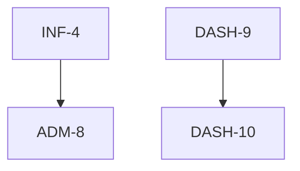

# Features & Backlog

**Purpose:** Comprehensive inventory of project features, user stories, and status  
**When to Create:** Project Inception / Sprint Planning  
**Owner:** Product Owner / Tech Lead  
**Location in Project:** [FEATURES](docs/context-engineering/FEATURES.md)  

---

## Sprint: SPR-02 (Enhancement Sprint)

**Sprint ID:** SPR-02
**Sprint Goal:** Enhance dashboard usability with pagination for bill details and admin configurability for the dashboard title.

---

## Features Overview

| Feature ID | Description | Owner | Complexity | Status |
|------------|-------------|-------|------------|--------|
| **DASH-10** | Bill Details Pagination | UI | 1 | Pending |
| **ADM-8** | Dashboard Title Configuration | Admin | 1 | Pending |

---

## 4. Epic: Public Dashboard & Visualization

### DASH-10: Bill Details Pagination
**Owner:** UI  
**Complexity:** 1  
**Priority:** High  
**Status:** Pending  

**Description:**  
Limit list to latest 10; add pagination for older records.

**User Story:**  
As a Resident, I want to see only recent bills by default, so the interface is not cluttered.

**Acceptance Criteria:**
- [ ] List restricted to 10 latest bills initially.
- [ ] "Load More" or Pagination button implemented.
- [ ] Fetches or reveals older records when requested.

### Technical Scope
**Affected Layers:** UI
**Affected Files:** `js/app.js`, `index.html`
**Dependencies:** DASH-9

### Test Requirements
- [ ] E2E tests for: Pagination flow
- [ ] Manual Check: List limit accuracy

### Estimated Effort
**Time:** 2 Hours
**Risk Level:** Low

---

## 5. Epic: Unit & System Administration

### ADM-8: Dashboard Title Configuration
**Owner:** Admin  
**Complexity:** 1  
**Priority:** Low  
**Status:** Pending  

**Description:**  
Admin interface to update the main title text displayed on the Public Dashboard.

**User Story:**  
As an Admin, I want to customize the dashboard title, so it reflects the correct building name or era.

**Acceptance Criteria:**
- [ ] Input field in Admin System settings.
- [ ] Saved to `system/settings` in Firestore.
- [ ] Public Dashboard title reads from this setting.

### Technical Scope
**Affected Layers:** UI, Application
**Affected Files:** `js/app.js`, `index.html`
**Dependencies:** INF-4

### Test Requirements
- [ ] Manual Check: Title update reflects on Public view
- [ ] Integration tests for: Settings update

### Estimated Effort
**Time:** 1 Hour
**Risk Level:** Low

---

## Dependencies Visualization

---

## Sprint Capacity

### Team Capacity
| Team Member | Availability | Assigned Work | Remaining Capacity |
|-------------|--------------|---------------|---------------------|
| UI Dev | 100% | DASH-10 | High |
| Admin Dev | 100% | ADM-8 | High |

### Velocity Tracking
**Previous Sprint Velocity:** 76 Points (SPR-01)  
**Current Sprint Commitment:** 2 Points  

---

## Feature Brief Status

| Feature ID | Brief Generated | Brief Reviewed | Assigned | Started |
|------------|-----------------|----------------|----------|---------|
| DASH-10 | ✅ | - | - | - |
| ADM-8 | ✅ | - | - | - |
