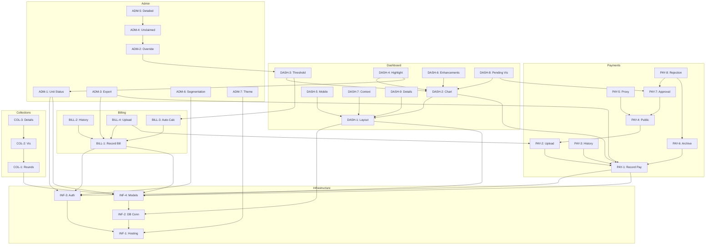

# Features & Backlog

**Purpose:** Comprehensive inventory of project features, user stories, and status  
**When to Create:** Project Inception / Sprint Planning  
**Owner:** Product Owner / Tech Lead  
**Location in Project:** [FEATURES](docs/context-engineering/FEATURES.md)  

---

## Sprint: Project Release 1.0 (Core Infrastructure & MVP)

**Sprint Duration:** N/A (Project History)  
**Sprint Goal:** Establish full lifecycle utility management, payment processing, transparency dashboard, and admin governance.

---

## Features Overview

| Feature ID | Description | Owner | Complexity | Status |
|------------|-------------|-------|------------|--------|
| **INF-1** | Set up Repository & Hosting | Lead | 2 | Done |
| **INF-2** | Database Connection Setup | Lead | 2 | Done |
| **INF-3** | Admin Authentication | Lead | 2 | Done |
| **INF-4** | Define Data Models | Lead | 3 | Done |
| **BILL-1** | Record New Bill | Admin | 2 | Done |
| **BILL-2** | Bill History View | Admin | 2 | Done |
| **BILL-3** | Auto-Calculate Global Break-Even | Logic | 3 | Done |
| **BILL-4** | Bill Softcopy Upload | Admin | 2 | Done |
| **PAY-1** | Record Unit Payment | Admin | 2 | Done |
| **PAY-2** | Receipt Image Upload | Admin | 3 | Done |
| **PAY-3** | Payment History per Unit | Admin | 2 | Done |
| **PAY-4** | Public Payment Submission | Public | 3 | Done |
| **PAY-5** | Seamless Public Upload (GAS Proxy) | Logic | 5 | Done |
| **PAY-6** | Payment Removal & Archiving | Admin | 2 | Done |
| **PAY-7** | Admin Approval Queue | Admin | 3 | Done |
| **PAY-8** | Rejected Payment Archiving | Admin | 2 | Done |
| **DASH-1** | Dashboard Layout & Data Fetching | UI | 3 | Done |
| **DASH-2** | Unit Bar Chart Component | UI | 3 | Done |
| **DASH-3** | Global Break-Even Threshold Line | UI | 2 | Done |
| **DASH-4** | Highlighted Unit Status | UI | 2 | Done |
| **DASH-5** | Mobile Responsiveness | UI | 3 | Done |
| **DASH-6** | Chart Enhancements | UI | 2 | Done |
| **DASH-7** | Layout & Stats Context | UI | 1 | Done |
| **DASH-8** | Pending Payment Visualization | UI | 2 | Done |
| **DASH-9** | View Bill Details | UI | 1 | Done |
| **ADM-1** | Unit Status Management | Admin | 1 | Done |
| **ADM-2** | Manual Threshold Override | Admin | 1 | Done |
| **ADM-3** | Data Export | Admin | 1 | Done |
| **ADM-4** | Unclaimed Funds Management | Admin | 2 | Done |
| **ADM-5** | Detailed Unclaimed Funds | Admin | 3 | Done |
| **ADM-6** | Admin UI Segmentation | Admin | 2 | Done |
| **ADM-7** | Theme Customization | Admin | 1 | Done |
| **COL-1** | Define Collection Round | Admin | 2 | Done |
| **COL-2** | Collection Round Visualization | Public | 2 | Done |
| **COL-3** | Extended Round Details | Public | 2 | Done |

---

## 1. Epic: Infrastructure & Core Setup

### INF-1: Set up Repository & Hosting
**Owner:** Lead  
**Complexity:** 2  
**Priority:** High  
**Status:** Done  

**Description:**  
Initialize Git repo and configure automated deployment to GitHub Pages.

**User Story:**  
As a developer, I want a CI/CD pipeline, so that code changes are automatically deployed to production.

**Acceptance Criteria:**
- [x] Git repository initialized.
- [x] GitHub Actions workflow created.
- [x] Site live on GitHub Pages.

### Technical Scope
**Affected Layers:** DevOps
**Affected Files:** `.github/workflows/deploy.yml`
**Dependencies:** None

### Test Requirements
- [ ] Integration tests for: GitHub Actions Workflow
- [ ] Manual Check: Site accessibility

### Estimated Effort
**Time:** 4 Hours   
**Risk Level:** Low

### INF-2: Database Connection Setup
**Owner:** Lead  
**Complexity:** 2  
**Priority:** High  
**Status:** Done  

**Description:**  
Configure connection to Firebase Firestore using the JS SDK.

**User Story:**  
As a developer, I want a central database connection, so I can persist application data.

**Acceptance Criteria:**
- [x] Firebase SDK integrated.
- [x] `js/config.js` created with credentials.
- [x] Database connectivity verified.

### Technical Scope
**Affected Layers:** Infrastructure
**Affected Files:** `js/config.js`, `js/db.js`
**Dependencies:** INF-1

### Test Requirements
- [ ] Unit tests for: `db.js` initialization
- [ ] Integration tests for: Firestore connection

### Estimated Effort
**Time:** 2 Hours
**Risk Level:** Low

### INF-3: Admin Authentication
**Owner:** Lead  
**Complexity:** 2  
**Priority:** High  
**Status:** Done  

**Description:**  
Implement Firebase Authentication (Email/Password) to protect Admin routes.

**User Story:**  
As an administrator, I want to log in securely, so that unauthorized users cannot change data.

**Acceptance Criteria:**
- [x] Login screen implementation.
- [x] Route protection for admin pages.
- [x] Logout functionality.

### Technical Scope
**Affected Layers:** Infrastructure, Security
**Affected Files:** `js/auth.js`
**Dependencies:** INF-2

### Test Requirements
- [ ] Unit tests for: Auth state listeners
- [ ] E2E tests for: Admin Login/Logout

### Estimated Effort
**Time:** 6 Hours
**Risk Level:** Medium

### INF-4: Define Data Models
**Owner:** Lead  
**Complexity:** 3  
**Priority:** High  
**Status:** Done  

**Description:**  
Design and implement JS classes for `Units`, `Bills`, and `Payments`.

**User Story:**  
As a developer, I want structured data models, so that business logic is consistent.

**Acceptance Criteria:**
- [x] `js/models.js` created.
- [x] Firestore collection structure defined.
- [x] DB seeded with 44 Units.

### Technical Scope
**Affected Layers:** Domain
**Affected Files:** `js/models.js`
**Dependencies:** INF-2

### Test Requirements
- [ ] Unit tests for: `Unit`, `Bill`, `Payment` classes
- [ ] Manual Check: Firestore seed data

### Estimated Effort
**Time:** 4 Hours  
**Risk Level:** Low

---

## 2. Epic: Monthly Bill Management

### BILL-1: Record New Bill
**Owner:** Admin  
**Complexity:** 2  
**Priority:** High  
**Status:** Done  

**Description:**  
Form for Admin to input Month, Year, Total Amount, and Issue Date.

**User Story:**  
As an Admin, I want to record electricity bills, so that the system knows the total break-even target.

**Acceptance Criteria:**
- [x] Admin form created.
- [x] Saves to `bills` collection.

### Technical Scope
**Affected Layers:** Application, UI
**Affected Files:** `js/app.js`, `index.html`
**Dependencies:** INF-4

### Test Requirements
- [ ] E2E tests for: Bill creation form submission
- [ ] Validation tests for: Input formats (Date, Amount)

### Estimated Effort
**Time:** 4 Hours
**Risk Level:** Low

### BILL-2: Bill History View
**Owner:** Admin  
**Complexity:** 2  
**Priority:** Medium  
**Status:** Done  

**Description:**  
List view of all recorded bills with Edit/Delete functionality.

**User Story:**  
As an Admin, I want to see past bills, so I can audit or correct mistakes.

**Acceptance Criteria:**
- [x] History table implemented.
- [x] Edit button functioning.
- [x] Delete button functioning.

### Technical Scope
**Affected Layers:** Application, UI
**Affected Files:** `js/app.js`
**Dependencies:** BILL-1

### Test Requirements
- [ ] E2E tests for: Bill list rendering
- [ ] E2E tests for: Edit and Delete actions

### Estimated Effort
**Time:** 4 Hours
**Risk Level:** Low

### BILL-3: Auto-Calculate Global Break-Even
**Owner:** Logic  
**Complexity:** 3  
**Priority:** High  
**Status:** Done  

**Description:**  
System updates the cumulative total and per-unit target whenever a bill changes.

**User Story:**  
As a Resident, I want accurate targets, so I know exactly how much is owed per unit.

**Acceptance Criteria:**
- [x] Triggers on Bill Create/Update/Delete.
- [x] Updates `system/stats` document.
- [x] Calculates `(Total / 44)` correctly.

### Technical Scope
**Affected Layers:** Domain Code
**Affected Files:** `js/models.js`, `js/app.js`
**Dependencies:** BILL-1

### Test Requirements
- [ ] Unit tests for: `calculateGlobalBreakEven` logic
- [ ] Integration tests for: System stats update trigger

### Estimated Effort
**Time:** 6 Hours
**Risk Level:** Medium

### BILL-4: Bill Softcopy Upload
**Owner:** Admin  
**Complexity:** 2  
**Priority:** Medium  
**Status:** Done  

**Description:**  
Allow Admin to upload/attach PDF/Image of the bill to the record.

**User Story:**  
As an Admin, I want to store the bill image, so there is proof of the expense.

**Acceptance Criteria:**
- [x] File upload input in Bill Form.
- [x] Link stored in Firestore.
- [x] Viewable in History table.

### Technical Scope
**Affected Layers:** Infrastructure, UI
**Affected Files:** `js/app.js`, `js/drive.js` (initially planned, implemented via Firestore/Softcopy link)
**Dependencies:** BILL-1, PAY-2

### Test Requirements
- [ ] Manual Check: File upload flow
- [ ] Integration tests for: File URL persistence

### Estimated Effort
**Time:** 4 Hours
**Risk Level:** Medium

---

## 3. Epic: Owner Payment Management

### PAY-1: Record Unit Payment
**Owner:** Admin  
**Complexity:** 2  
**Priority:** High  
**Status:** Done  

**Description:**  
Form for Admin to record payments for specific units.

**User Story:**  
As an Admin, I want to log check/cash payments, so the unit's debt decreases.

**Acceptance Criteria:**
- [x] Unit selection dropdown.
- [x] Amount and Date input.
- [x] Updates Unit's `totalContributed`.

### Technical Scope
**Affected Layers:** Application, Domain
**Affected Files:** `js/app.js`, `js/models.js`
**Dependencies:** INF-4

### Test Requirements
- [ ] Integration tests for: Payment record creation + Unit total increment (Atomic update)
- [ ] E2E tests for: Payment form

### Estimated Effort
**Time:** 5 Hours
**Risk Level:** High

### PAY-2: Receipt Image Upload
**Owner:** Admin  
**Complexity:** 3  
**Priority:** High  
**Status:** Done  

**Description:**  
Upload interface integrated with Google Drive API.

**User Story:**  
As an Admin, I want digital copies of receipts, so I don't have to keep paper copies.

**Acceptance Criteria:**
- [x] Google Drive API integration.
- [x] Returns web view link.
- [x] Link saved with Payment record.

### Technical Scope
**Affected Layers:** Infrastructure
**Affected Files:** `js/drive.js`, `js/app.js`
**Dependencies:** PAY-1

### Test Requirements
- [ ] Integration tests for: Google Drive API upload
- [ ] Manual Check: Google Auth flow for upload

### Estimated Effort
**Time:** 8 Hours
**Risk Level:** High (External API)

### PAY-3: Payment History per Unit
**Owner:** Admin  
**Complexity:** 2  
**Priority:** Medium  
**Status:** Done  

**Description:**  
Admin view to see ledger of payments for a specific unit.

**User Story:**  
As an Admin, I want to see a specific unit's history, so I can answer owner inquiries.

**Acceptance Criteria:**
- [x] Filter/Dropdown by Unit.
- [x] Table display of transactions.

### Technical Scope
**Affected Layers:** UI
**Affected Files:** `js/app.js`
**Dependencies:** PAY-1

### Test Requirements
- [ ] E2E tests for: Filtering Payments by Unit
- [ ] Manual Check: Data accuracy in table

### Estimated Effort
**Time:** 3 Hours
**Risk Level:** Low

### PAY-4: Public Payment Submission
**Owner:** Public  
**Complexity:** 3  
**Priority:** High  
**Status:** Done  

**Description:**  
Interface for residents to submit payment records and upload receipts.

**User Story:**  
As a Resident, I want to submit my payment proof online, so I don't have to message the admin.

**Acceptance Criteria:**
- [x] Public-facing form.
- [x] Creates `pending_payments` record.

### Technical Scope
**Affected Layers:** Application, UI
**Affected Files:** `index.html`, `js/app.js`
**Dependencies:** PAY-2

### Test Requirements
- [ ] E2E tests for: Public form submission
- [ ] Validation tests for: Input fields

### Estimated Effort
**Time:** 6 Hours
**Risk Level:** Medium

### PAY-5: Seamless Public Upload (GAS Proxy)
**Owner:** Dev  
**Complexity:** 5  
**Priority:** High  
**Status:** Done  

**Description:**  
Google Apps Script proxy to allow public uploads without user Google Auth.

**User Story:**  
As a Resident, I want to upload a photo without signing into Google, so it's frictionless.

**Acceptance Criteria:**
- [x] `Code.gs` implemented.
- [x] Web App deployed.
- [x] Frontend sends base64 data to proxy.

### Technical Scope
**Affected Layers:** Backend (Proxy), Infrastructure
**Affected Files:** `google-apps-script/Code.gs`, `js/drive.js`
**Dependencies:** PAY-4

### Test Requirements
- [ ] Manual Check: Upload without Google Login
- [ ] Integration tests for: GAS Web App Endpoint

### Estimated Effort
**Time:** 12 Hours
**Risk Level:** Critical

### PAY-6: Payment Removal & Archiving
**Owner:** Admin  
**Complexity:** 2  
**Priority:** High  
**Status:** Done  

**Dependencies:** PAY-1

**Description:**  
Admin capability to archive records and remove them from totals.

**User Story:**  
As an Admin, I want to fix erroneous entries, so the accounts remain accurate.

**Acceptance Criteria:**
- [x] Soft-delete (Archive) functionality.
- [x] Reconstruct unit totals.
- [x] Permanent delete from Archive.

### Technical Scope
**Affected Layers:** Domain, Application
**Affected Files:** `js/app.js`
**Dependencies:** PAY-1

### Test Requirements
- [ ] Unit tests for: Reverting unit totals on archive
- [ ] E2E tests for: Archive/Delete flows

### Estimated Effort
**Time:** 4 Hours
**Risk Level:** High (Data Integrity)

### PAY-7: Admin Approval Queue
**Owner:** Admin  
**Complexity:** 3  
**Priority:** High  
**Status:** Done  

**Dependencies:** PAY-4

**Description:**  
UI to view Pending payments, Approve (move to Active), or Reject.

**Acceptance Criteria:**
- [x] Pending Payments table.
- [x] Approve action validates and moves data.
- [x] Reject action moves to Archive.

### Technical Scope
**Affected Layers:** Application, UI
**Affected Files:** `js/app.js`
**Dependencies:** PAY-4

### Test Requirements
- [ ] E2E tests for: Approval workflow (Pending -> Active)
- [ ] E2E tests for: Rejection workflow

### Estimated Effort
**Time:** 6 Hours
**Risk Level:** Medium

### PAY-8: Rejected Payment Archiving
**Owner:** Admin  
**Complexity:** 2  
**Priority:** Medium  
**Status:** Done  

**Dependencies:** PAY-7

**Description:**  
Track rejected payments explicitly in the archive.

**Acceptance Criteria:**
- [x] `rejectionReason` field added.
- [x] Archive filter for "Rejected".

### Technical Scope
**Affected Layers:** UI
**Affected Files:** `js/app.js`
**Dependencies:** PAY-7

### Test Requirements
- [ ] Manual Check: Rejection reason storage
- [ ] E2E tests for: Filter functionality in Archive view

### Estimated Effort
**Time:** 2 Hours
**Risk Level:** Low

---

## 4. Epic: Public Dashboard & Visualization

### DASH-1: Dashboard Layout & Data Fetching
**Owner:** UI  
**Complexity:** 3  
**Priority:** High  
**Status:** Done  

**Description:**  
Main landing page aggregating Bill and Payment data.

**Acceptance Criteria:**
- [x] Stats Grid (Bills, Target, Collected).
- [x] Data loaded from Firebase on init.

### Technical Scope
**Affected Layers:** UI, Infrastructure
**Affected Files:** `js/app.js`, `index.html`
**Dependencies:** INF-2, INF-4

### Test Requirements
- [ ] E2E tests for: Dashboard load performance
- [ ] Manual Check: Stats accuracy

### Estimated Effort
**Time:** 6 Hours
**Risk Level:** Medium

### DASH-2: Unit Bar Chart Component
**Owner:** UI  
**Complexity:** 3  
**Priority:** High  
**Status:** Done  

**Description:**  
Bar chart displaying "Total Contributed" per Unit (1-44).

**Acceptance Criteria:**
- [x] Chart.js integration.
- [x] X-Axis: Units, Y-Axis: Currency.

### Technical Scope
**Affected Layers:** UI
**Affected Files:** `js/app.js` (Chart.js init)
**Dependencies:** DASH-1, PAY-1

### Test Requirements
- [ ] Manual Check: Chart rendering on various screen sizes
- [ ] Validation tests for: Data mapping to chart bars

### Estimated Effort
**Time:** 5 Hours
**Risk Level:** Medium

### DASH-3: Global Break-Even Threshold Line
**Owner:** UI  
**Complexity:** 2  
**Priority:** High  
**Status:** Done  

**Description:**  
Horizontal line representing the share per unit target.

**Acceptance Criteria:**
- [x] Calculated from System Stats.
- [x] Drawn correctly across chart.

### Technical Scope
**Affected Layers:** UI
**Affected Files:** `js/app.js` (Chart annotation)
**Dependencies:** DASH-2, BILL-3

### Test Requirements
- [ ] Manual Check: Threshold line position against data
- [ ] Unit tests for: Threshold value calculation

### Estimated Effort
**Time:** 3 Hours
**Risk Level:** Low

### DASH-4: Highlighted Unit Status
**Owner:** UI  
**Complexity:** 2  
**Priority:** Medium  
**Status:** Done  

**Description:**  
Visual indicator (Orange bar) for special case units.

**Acceptance Criteria:**
- [x] Checks `isHighlighted` flag.
- [x] Tooltip shows `publicNote`.

### Technical Scope
**Affected Layers:** UI
**Affected Files:** `js/app.js`
**Dependencies:** DASH-2, ADM-1

### Test Requirements
- [ ] Manual Check: Hover tooltips on Highlighted units
- [ ] Manual Check: Bar color changes

### Estimated Effort
**Time:** 3 Hours
**Risk Level:** Low

### DASH-5: Mobile Responsiveness
**Owner:** UI  
**Complexity:** 3  
**Priority:** Medium  
**Status:** Done  

**Description:**  
Ensure chart and tables are readable on mobile.

**Acceptance Criteria:**
- [x] Media queries for layout.
- [x] Horizontal scrolling for tables.

### Technical Scope
**Affected Layers:** UI (CSS)
**Affected Files:** `css/style.css`
**Dependencies:** DASH-1

### Test Requirements
- [ ] Manual Check: Responsive behavior on Mobile/Tablet/Desktop

### Estimated Effort
**Time:** 6 Hours
**Risk Level:** Low

### DASH-8: Pending Payment Visualization
**Owner:** UI  
**Complexity:** 2  
**Priority:** High  
**Status:** Done  

**Description:**  
Show Pending Payments as a stacked dotted bar segment.

**Acceptance Criteria:**
- [x] Stacked bar chart configuration.
- [x] Pending data dataset added.

### Technical Scope
**Affected Layers:** UI
**Affected Files:** `js/app.js`
**Dependencies:** DASH-2, PAY-7

### Test Requirements
- [ ] Manual Check: Stacked bar visualization
- [ ] Validation tests for: Correct pending sum calculation

### Estimated Effort
**Time:** 4 Hours
**Risk Level:** Medium

### DASH-9: View Bill Details
**Owner:** UI  
**Complexity:** 1  
**Priority:** Medium  
**Status:** Done  

**Description:**  
Toggleable list of electric bills used for calculation.

**Acceptance Criteria:**
- [x] "See Details" toggle.
- [x] List rendered in dashboard.

### Technical Scope
**Affected Layers:** UI
**Affected Files:** `index.html`, `js/app.js`
**Dependencies:** DASH-1

### Test Requirements
- [ ] E2E tests for: Toggle functionality

### Estimated Effort
**Time:** 2 Hours
**Risk Level:** Low

---

## 5. Epic: Unit & System Administration

### ADM-1: Unit Status Management
**Owner:** Admin  
**Complexity:** 1  
**Priority:** Medium  
**Status:** Done  

**Description:**  
Toggle "Highlighted" status and edit Public Note.

**Acceptance Criteria:**
- [x] Admin UI for Unit properties.
- [x] Updates Firestore `units` collection.

### Technical Scope
**Affected Layers:** Application
**Affected Files:** `js/app.js`
**Dependencies:** INF-4

### Test Requirements
- [ ] E2E tests for: Toggling Highlight status
- [ ] E2E tests for: Editing Public Note

### Estimated Effort
**Time:** 3 Hours
**Risk Level:** Low

### ADM-2: Manual Threshold Override
**Owner:** Admin  
**Complexity:** 1  
**Priority:** Low  
**Status:** Done  

**Description:**  
Manually set the Threshold Line value.

**Acceptance Criteria:**
- [x] Settings toggle "Enable Override".
- [x] Input field for manual value.

### Technical Scope
**Affected Layers:** Domain, Application
**Affected Files:** `js/app.js`, `js/models.js`
**Dependencies:** DASH-3

### Test Requirements
- [ ] Unit tests for: Override logic precedence in calculation
- [ ] E2E tests for: Setting/Unsetting override

### Estimated Effort
**Time:** 2 Hours
**Risk Level:** Low

### ADM-4 & ADM-5: Unclaimed Funds Management
**Owner:** Admin  
**Complexity:** 3  
**Priority:** High  
**Status:** Done  

**Description:**  
Manage floating amounts and visualize as special chart entry.

**Acceptance Criteria:**
- [x] Unclaimed Records collection.
- [x] Conversion to Unit Payment flow.
- [x] Special bar in Chart.js.

### Technical Scope
**Affected Layers:** Domain, UI
**Affected Files:** `js/app.js`, `js/models.js`
**Dependencies:** ADM-2

### Test Requirements
- [ ] Integration tests for: Unclaimed record creation
- [ ] E2E tests for: Conversion from Unclaimed to Payment
- [ ] Manual Check: Dashboard visualization of 'Unclaimed'

### Estimated Effort
**Time:** 8 Hours
**Risk Level:** Medium

### ADM-6: Admin UI Segmentation
**Owner:** Admin  
**Complexity:** 2  
**Priority:** Medium  
**Status:** Done  

**Description:**  
Tabbed navigation for Admin sections.

**Acceptance Criteria:**
- [x] Tabs: Bills, Payment, Units, System.
- [x] View switching logic.

### Technical Scope
**Affected Layers:** UI
**Affected Files:** `index.html`, `js/app.js`
**Dependencies:** INF-3

### Test Requirements
- [ ] Manual Check: Tab navigation flow
- [ ] E2E tests for: View visibility

### Estimated Effort
**Time:** 4 Hours
**Risk Level:** Low

### ADM-7: Theme Customization
**Owner:** Admin  
**Complexity:** 1  
**Priority:** Low  
**Status:** Done  

**Description:**  
 Configure Primary/Secondary colors.

**Acceptance Criteria:**
- [x] Color picker in Admin.
- [x] Saves to `system/settings`.
- [x] Applies CSS variables dynamically.

### Technical Scope
**Affected Layers:** UI (CSS)
**Affected Files:** `js/app.js`, `css/style.css`
**Dependencies:** INF-1

### Test Requirements
- [ ] Manual Check: Theme color application across components
- [ ] Integration tests for: Settings persistence

### Estimated Effort
**Time:** 3 Hours
**Risk Level:** Low

---

## 6. Epic: Collection Rounds

### COL-1: Define Collection Round
**Owner:** Admin  
**Complexity:** 2  
**Priority:** High  
**Status:** Done  

**Description:**  
Form to Create/Edit a Round with participating units.

**Acceptance Criteria:**
- [x] Round creation form.
- [x] Multi-select for Units.

### Technical Scope
**Affected Layers:** Application
**Affected Files:** `js/app.js`
**Dependencies:** INF-4

### Test Requirements
- [ ] E2E tests for: Creating a new Round
- [ ] Validation tests for: Participant selection

### Estimated Effort
**Time:** 5 Hours
**Risk Level:** Medium

### COL-2 & COL-3: Round Visualization
**Owner:** UI  
**Complexity:** 2  
**Priority:** High  
**Status:** Done  

**Description:**  
Dashboard widget for Active Round details and history.

**Acceptance Criteria:**
- [x] "Active" round display.
- [x] Progress calculation.
- [x] Toggleable participant list.

### Technical Scope
**Affected Layers:** UI
**Affected Files:** `js/app.js`, `index.html`
**Dependencies:** COL-1

### Test Requirements
- [ ] Manual Check: Round widget display on Dashboard
- [ ] Unit tests for: Round progress calculation

### Estimated Effort
**Time:** 5 Hours
**Risk Level:** Low

---

## Dependencies Visualization

**Blockers:**

- None (Project Complete).

---

## Sprint Capacity

### Team Capacity (Retrospective)
| Team Member | Availability | Assigned Work | Remaining Capacity |
|-------------|--------------|---------------|---------------------|
| Lead | 100% | Infrastructure, Auth, Models | 0% |
| Admin Dev | 100% | Bill/Payment Mgmt, Approval | 0% |
| UI Dev | 100% | Dashboard, Charts, Responsiveness | 0% |

### Velocity Tracking
**Method:** Velocity is calculated based on the sum of **Complexity (1-5)** points assigned to each feature.  
**Previous Sprint Velocity:** N/A   
**Current Sprint Commitment:** 76 Complexity Points (34 Features)  
**Achieved Velocity:** 76 Points  
**Buffer:** 0%  

---

## Technical Risks

| Risk | Feature | Likelihood | Impact | Mitigation |
|------|---------|------------|--------|------------|
| Google Drive API Quota Limits | PAY-2, PAY-5 | Medium | High | Monitor usage, consider paid tier or compression. |
| Firestore Read Costs | ASH-1 | Medium | Low | Use `count()` aggregation and limit initial fetch. |
| Public Upload Abuse | PAY-5 | Low | High | Admin Approval Queue (PAY-7) filters content before publishing. |

---

## Feature Brief Status

| Feature ID | Brief Generated | Brief Reviewed | Assigned | Started |
|------------|-----------------|----------------|----------|---------|
| INF-x | ✅ | ✅ | ✅ | ✅ |
| BILL-x | ✅ | ✅ | ✅ | ✅ |
| PAY-x | ✅ | ✅ | ✅ | ✅ |
| DASH-x | ✅ | ✅ | ✅ | ✅ |
| ADM-x | ✅ | ✅ | ✅ | ✅ |
| COL-x | ✅ | ✅ | ✅ | ✅ |

---

## Definition of Done

**For this project release, a feature is "Done" when:**

- [x] Code implemented and follows [examples](examples/README_examples.md) patterns
- [x] No violations of [ANTI PATTERNS](ANTI_PATTERNS.md)
- [x] All acceptance criteria met
- [x] Logic validated manually (Thick Client)
- [x] Deployed to GitHub Pages
- [x] Validated in Production environment
- [x] Documentation updated (FEATURES.md, DESIGN.md)

---

## Sprint Ceremonies

### Daily Standup
**Focus:** Progress tracking via MasterPlan.md.

### Sprint Review
**Outcome:** Release 1.0 deployed and live.

### Retrospective
**Lessons Learned:**
- **Google Apps Script:** Proved highly effective for bypassing auth on public uploads.
- **Firestore Costs:** Reading entire collections for stats is risky; migrated to client-side aggregation on small datasets, future optimization needed.
- **Mobile First:** Dashboard required significant CSS adjustments for phone screens.

---

## Metrics to Track

### Code Quality
- [x] Anti-pattern violations: 0 (Known)
- [x] Code modularity: High (MVC Separation)

### Productivity
- [x] Features completed: 100%
- [x] Rollback rate: 0%

---

## Notes

### Scope Changes
- **Detailed Unclaimed Funds (ADM-5):** Added mid-project to handle accounting discrepancies.
- **Themes (ADM-7):** Added as user request for branding customization.

**Version:** 1.0.0
**Last Updated:** 2024-05-24

